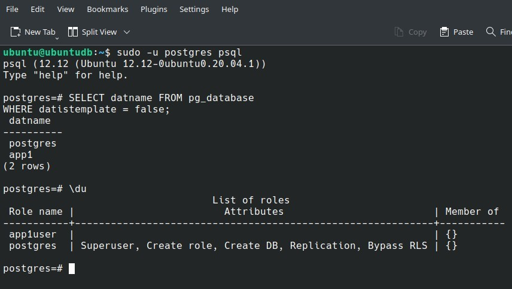
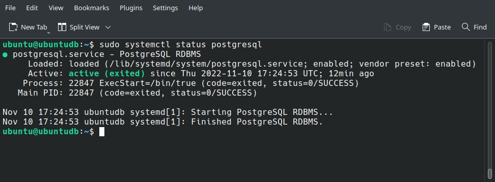
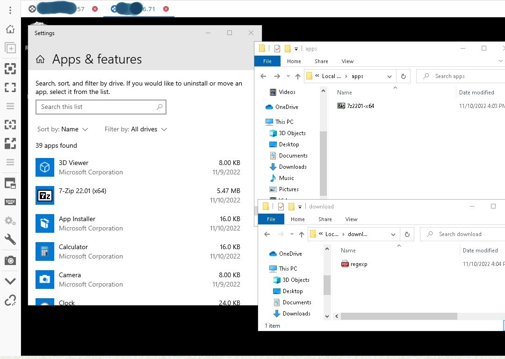

# Тестовое задание  
Обеспечить тестирование (QA стенда) для платформы roomybots в составе App server (Win) + DB (PostgreSQL& Linux) + 5 Client (Win Desktop)  
Сервер: roomyS_1_1.msi    
Клиент: roomyC_1_1.deb, roomyD_1_1.pdf  
## Цели:

1. Развернуть инфраструктуру.
2. Выполнить установку необходимых пакетов.
3. Описать методы, инструменты, подходы и тд..

---
Реализовал автоматическое развёртывание и настройку в облаке для демонстрации, в связи с тем, что дома нет подходящего железа (ресурсы, лицензия , регистрация триал версиий продуктов и тд ) для развёртывания в других средах (wmware hyperv proxmox и тд). Вначале опишу что сделано и как, а ниже будет описание решений, инструментов, подходов.
### Реализация в Yandex Cloud

Инструменты, которые использовались:     
+ Система с которой производились все манипуляции: Ubuntu 22.04.1 LTS
+ QEMU
+ Packer
+ Консольная утилита от yandex yc
+ S3cmd — консольный клиент (Linux, Mac) для сервисов, поддерживающими HTTP API Amazon S3 для управления бакетом S3 в Cloud
+ Terraform
+ Ansible (установлен доп модуль для winrm и возможности настраивать win хосты)

В Yandex Cloud создан отдельный каталог, сервисный аккаунт с нужными правами, API ключи, в Object Storage создан S3 бакет для хранения образов и других данных (например файлы состояний для terraform).

#### Packer  
Подготовлеы образы с Windows (Win server 2016 и win10) для возможности импортировать в yandex cloud и дальнейшего использования при создании VM.
Действия согласно официальной документации от Yandex:   

+ Установлен QEMU (был ранее установлен).
+ Установить Packer (был ранее установлен).
+ Packer сборка образа:  
  + Загружен архив с готовыми конфигурациями для Packer, распакован в нужную папку (windows-packer).
  + Загружены драйверы для использования образа в виртуальной среде. Папки NetKVM, vioserial и viostor скопированы в папку windows-packer/drivers.
+ Настроен конфиг для packer:   
  + Параметр iso_url - путь к вашему дистрибутиву.
  + iso_checksum - данные sha256 образа
+ В блоке cd_files указаны пути к распакованным драйверам для нужной версии ОС, например:   

```
cd_files = [
    "../drivers/netkvm/2k16/amd64/*",
    "../drivers/viostor/2k16/amd64/*",
    "../drivers/vioserial/2k16/amd64/*",
    "../scripts/qemu/*",
    "Autounattend.xml"
  ]  
```
В папку ../scripts/ можно положить также свои скрипты для автоматизации, на данном этапе производится тест работает ли решение в целом.
+ Выполнена сборка (команда "packer build ." )
После, запустится QEMU, можно настроить систему и произвести выключение машины.
После выполнения команды будет создан дисковый образ в формате .qcow2.

+ Полученный образ загружен в ранее созданный Object Storage
"s3cmd --storage-class COLD put packer-w10gui s3://roomy-bucket-s3"

+ Импортирован образ в Compute Cloud для дальнейшего использования
```yc compute image create --name win10 --description win10 --os-type windows --source-uri "url ссылка в бакете где лежит образ qcow2 "```

#### Terraform
+ Установлен провайдер для взаимодействия с yandex cloud, подготовлены конфиги
+ terraform apply отрабатывает успешно: 
  + Автоматически создаётся сеть
  + Создаются подсети
  + Автоматом создаются виртуальные машины с заранеее подготовленными образами с нужными ресурсами (в зависимости от workspace dev, test и тп.)
  + Автоматически добавляется ssh ключ
В итоге все нужные машины запущены и к ним можно подключиться по ssh или rdp , они готовы для настройки:    
<p align="center"> </p> 

#### Ansible 

+ Подготовлены playbook для win2016, машин win 10, машин deb и db server (Postgresql) 
+ Все плейбуки успешно отрабатываются, выполняются ожидаемые действия , нужные пакеты устанавливаются.

ps. В связи с тем что образ очень долго собирается (не было возможности выделить все ресурсы на своем ПК для ускорения), а также долго закачивается в облако (в холодное хранилище, т.к. оно дешевле) не было времени довести до идеала сам образ чтобы максимально минимизировать ручную настройку, но это всё можно сделать. Поэтому, например, для возможности использовать Ansible в windows нужно было несколько манипуляций для настройки winrm (выполнен готовый скрипт Powershell от Ansible).   

в итоге после запуска плейбуков: 
+ Установлен Postgresql, создана тестовая база, проверено что сервис запущен, в бд можно зайти и тд. 
+ На машинах deb установлен необходимый пакет
+ На машинах win10 автоматически устанавливается нужное ПО, создаются папки и скачивается тестовый файл pdf
ps. Естественно, если продумывать шифрование секретов, дописывать debug, добавлять возможности проверки, дорабатывать и тд. - времени нужно больше

Итоговые скришоты:  
Postgresql -в автоматическом режиме установлены необходимые пакеты, создан пользователь и тестовая пустая БД: 
<p align="center"> </p>
Postgresql service: 
<p align="center"> </p>
Отработка ansible, в автоматическом режиме скачан Sol,  установлен тестовый deb пакет на ubuntu машины:   
<p align="center"> </p>
Успешная отработка плейбука, в автоматическом режиме - создана папка для скачивания ПО, скачан файл для установки, выполнена установка 7zip (пример установки exe файла), скачан тестовый файл из репозитория (pdf):     
<p align="center"> </p>

### 1. Выбор инфраструктуры:

Выбор решения относительно инфраструктуры, будет обусловлен этим:   

+ Изучаем что есть на данный момент, чем пользуется команда, что привычно и знакомо.
+ Есть ли физический сервер с достаточными ресурсами.
+ Есть ли облако у компании и какое, с какими возможностями
+ Есть ли лицензии на платное ПО (гипервизоры , ОС, клиенты и тд.)
+ Какой бюджет.

Если, например, уже есть лицензия VMware vSphere и vCenter Server и есть рабочая среда , накопленный опыт использования и тд, то : 
+ Разворачиваем отдельно виртуальные машины изолируем их от той части сети из которой доступ запрещён (отдельная подсеть, VLAN и тд)
Если преимущественно используются продукты Microsoft и есть лицензии, то наверное лучше использовать Microsoft Hyper-V.
Тоже самое, если используется например XenServer и там уже привычнее для всех и есть наработки, покрываются все потребности и нет проблем, то это решение.

Если ничего, то что выше описано нет: 

+ Нужно быстро подготовить, развернуть среду без особых требований к масштабам (как по ресурсам, задачам, объёмам, надежности стабильности, управлению, возможностям и тд. ) и не для продакшена, а для тестов у себя я бы выбрал ProxMox (тоже самое про VirtualBox, использование Vagrant).
Причина выбора Proxmox - уже сталкивался с данным гипервизором, для моих задач показался более удобным, гибким , а также :
+ Это дистрибутив Linux на основе Debian (с Debian сталкивался больше, хорошо разито общество, форумы, более быстрый поиск решений проблем, больше информации и тд,)
+ Открытый исходный код, бесплатное решение , есть возможности его дорабатывать "под себя", расширять и тд.
+ Для решения небольших задач, домашнего сервера и не для большого бизнеса, более выгодный вариант в отличии, например дорогостоящей реализации VMware среды.
+ Есть возможность реализовать резервное копирование, клонирование машин, шаблоны, Vlan, Firewall, балансировку, создать кластер и тд.

Для серьёзного бизнес решения, отказоустойчивости, возможности масштабирования и надежности, наверное лидирует VMware.

---
### Инструменты, методы:

#### Подготовка инфраструктуры: 
В случае если это разовая настройка и подготовка среды, можно сделать всё вручную (разве что клонировать полностью одинаковые настроенные машины). Возможно, с помощью Packer подготовить настроенные образы с установленным ПО , обновлениями и тд, для быстрого развертывания. 

Packer и Terraform: 

#### Packer:
+ Автоматизация и быстрое создание идентичных, настроенных образов, с помощью одного шаблона Packer.
+ Ускорение создания инстанса в облаке или виртуалке для разработчика из готового образа
+ Образ виртуальной машины будет готов заранее и всегда соответствовать нужному набору ПО
+ Установлены все пакеты, настроена система, обновления и тд.
+ Готовый образ можно делать для разных сред и для облака и для wmware и тд. 

Далее, собранный , проверенный, настроенный образ с необходимым ПО, нужными версиями (можно сделать заранее несколько образов по шаблонам, которые часто используются или будут использоваться) используем напрямую для загрузки в облако или в свою виртуальную среду, либо используем для Terraform и разворачиваем инфраструктуру на основе подготовленных образов.  

#### Terraform:
+  позволяет описать инфраструктуру как код, автоматизировать подготовку среды, создание виртуальных, описания ресурсов сетевых компонентов, настройка сети, проброс ssh ключей.
+  Возможность изменять параметры виртуальных машин, удалять, создавать новые, запускать , останавливать, расширять дисковое пространство и тд. В зависимости от конфигураций terraform.
+  Переиспользовать код, избавиться от возможных ошибок ручной настройки.
+  Скорость развертывания и идентичность, постоянность.
+  Можем сразу же проверить, что и в каком порядке будет добавлено, в каком конечном состоянии будет та или иная виртуальная машина или виртуальная сеть.
+  Возможность описывать большинство популярных облачных платформ.
+  Управлять несколькими облачными провайдерами и распространять инфраструктуру между ними для повышения отказоустойчивости (меняется провайдер для отдельного облака или виртуальной среды и используется своя конфигурация)
+  Удобное использование для создания демо-стендов под тестирование и отладку ПО.
+  Удобно читать и корректировать конфигурацию другим участника процесса.

### Автоматизация установки ПО и настройки серверов:
В случае если нужна разовая настройка, это происходит очень редко, одинаковые машины, одинаковые системы и тд : 
+ В плане установки дополнительного ПО : можно использовать для Windows автоматизацию с помощью скриптов, особенно если уже есть успешное применение , закрытие потребностей. ( Winrm для удаленного управления, PowerShell Desired State Configuration, обычные скрипты PowerShell или bat файлы и тд.) если они понятны для всех участников (кто будет это использовать и участвовать в процессе). (Invoke-Command, Copy-Item,Start-Process, xcopy и тд, а дальше брать список машин из файла/переменной, и последовательно копировать, устанавливать в тихом режиме, проверять установку)  
Для Linux соответсвенно - bash скрипты, python, если нужна голая система и только установить недостающие несколько пакетов, то вообще однострочники вполне справятся, одной командой. 
Сами примеры скриптов в случаем наличия времени могу подготовить проверить, ранее сам не писал ( кроме батников для резервного копирования, настройки сети и прочего для локальных действий), но думаю смогу разобраться что делает скрипт, как работает и переделать под себя. 

Я бы выбрал Ansible для автоматизации настройки сервера, потому что:  

+ Знаком с данным инструментом, он показал себя эффективным для решения рутинных задач (преимущественно, конечно для Linux дистрибутивов).
+ PowerShell скрипты могут быть достаточно разрозненными, сложными и если их написал отдельный человек и только он разбирается как это всё работает, могут быть проблемы. Может быть не просто их читать другим специалистам. Но их также можно использовать в ansible (копировать запускать на удаленном хосте)  
+ YAML-конфиги которые использует Ansible более понятны, структуированы.
+ Решение идентичных проблем можно заменить общими ролями, которые можно переиспользовать.
+ Можно (нужно) создать репозиторий, где лежат роли, плейбуки, документация как это работает, описание.
+ В едином месте описана настройка сервером, машин, в ввиде кода, который достаточно удобно читать и понимать всем участникам.
+ Проверить успешность деплоя можно в единой точке. Хорошо работает debug ролей, можно понять на каком этапе произошла ошибка или не отработала задача (по каждому тегу или переменной в которой записывается статус, можно посмотреть причину )
+ Все участники знают где искать логи и могут их читать.

Также можно использовать, запускать скрипты и в самом Ansible, но сразу видеть результат отработки и перепроверять выполнилась ли задача успешно.
+  Есть много уже готовых официальных решений (роли, плейбуки) которые можно переделывать под себя, переиспользовать.
+ Хорошая документация с описанием решения многих часто встречающихся задач.
+ Есть возможность шифровать критически важные данные (пароли, секреты). 

Если подготовить правильно роли, можно автоматически с помощью условий (если используется конкретная ОС на клиенте, то применять конкретные задачи именно для этой ОС) т.е. можно установить нужные пакеты и выполнить настройку одновременно на несколько разных клиентах и каждый будет настроен по своему , но через использование одного инструмента из одного места запуска используя один и тот же код.  

Также, через Ansible можно настраивать машины как в облаке, так и практически в любых средах виртуализации и инструментах, например для Vagrant. Например - на хосте разработчика запускается Vagrant , далее прогоняется плейбук с Ansible для конечной настройки созданной виртуальной машины. 

---   

